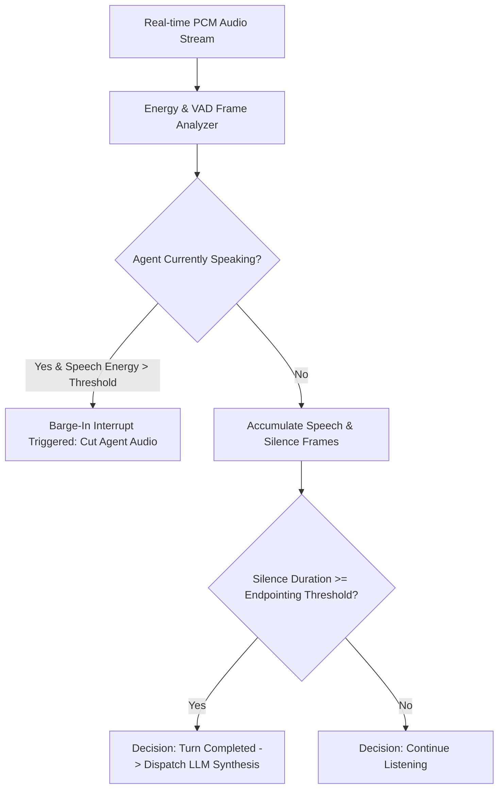

# GenPark AI Agent Skill - Voice Turn-Taking & Endpointing Detector

Acoustic voice activity detection (VAD), dynamic silence endpointing, and barge-in interruption arbitrator for real-time conversational voice agents.

Verified by [GenPark AI](https://genpark.ai) and compatible with [Model Context Protocol (MCP)](https://genpark.ai/mcp).

## Architecture Diagram

## Features
- **Low-Latency VAD Heuristics**: Operates on sub-frame time slices for immediate interruption handling.
- **Dynamic Endpointing**: Automatically balances conversational fluidity against premature turn cutoff.
- **Zero External Dependencies**: Pure Python standard library implementation.
